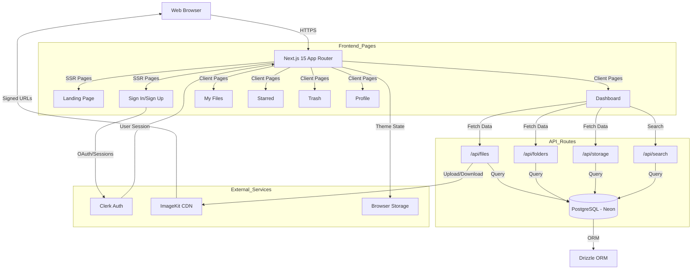
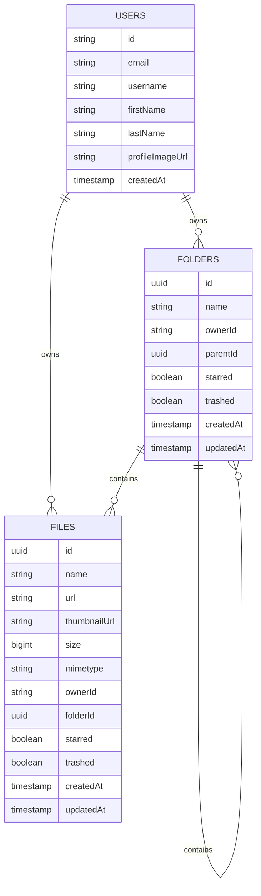

# System Architecture

| Project | **Version** | **Last Updated** |
| :--- | :--- | :--- |
| Arkive | 1.0 | December 17, 2025 |

---

## 1. High-Level Design
The system follows a **Server-Side Rendered (SSR) Monolith** architecture using Next.js 15 App Router. The frontend and API routes coexist in a single deployment, enabling fast page loads and SEO optimization. File storage is offloaded to ImageKit CDN, while authentication is handled by Clerk's hosted service.

### System Diagram


---

## 2. Tech Stack

| Layer | Technology | Reason for Choice |
| :--- | :--- | :--- |
| **Frontend** | Next.js 15 (App Router) | Server-Side Rendering for landing pages, React Server Components for performance, built-in API routes. |
| **UI Library** | shadcn/ui + Tailwind CSS | Pre-built accessible components, fully customizable with Tailwind, no runtime JS overhead. |
| **State Management** | React Hooks (useState, useCallback) | Simple client-side state without Redux complexity; useCallback prevents unnecessary re-renders. |
| **Authentication** | Clerk | Hosted auth with OAuth, email verification, profile management; eliminates need for custom auth backend. |
| **Database** | PostgreSQL (Neon) | Relational integrity for User-Folder-File hierarchy; serverless autoscaling with Neon. |
| **ORM** | Drizzle | Type-safe SQL queries with TypeScript inference; lightweight compared to Prisma. |
| **File Storage** | ImageKit | CDN with automatic optimization, signed URLs for security, 20GB free tier. |
| **Validation** | Zod | Runtime type validation for API inputs; integrates with react-hook-form. |
| **Icons** | Lucide React | Tree-shakeable icon library with consistent design; 1000+ icons. |
| **Theming** | next-themes | Client-side theme persistence with no flash on load; system preference detection. |
| **Notifications** | Sonner | Lightweight toast library with Promise support and stacking; better UX than alerts. |
| **Deployment** | Vercel | Zero-config deployment for Next.js; edge network for fast global access. |

---

## 3. Database Schema

We use a normalized relational schema optimized for hierarchical file/folder queries. Below is the Entity Relationship Diagram (ERD).



### Key Indexes
For optimal query performance, the following indexes are applied:

- **`folders(ownerId, parentId, trashed)`** - Fast folder listing by owner and parent
- **`folders(ownerId, starred)`** - Quick starred folder retrieval
- **`files(ownerId, folderId, trashed)`** - Efficient file retrieval within folders
- **`files(ownerId, starred)`** - Fast starred file queries
- **`files(ownerId, createdAt DESC)`** - Recent files ordering
- **`files(name)`** - Full-text search on file names (GIN index for ILIKE queries)

---

## 4. Key Technical Decisions

### Why Next.js App Router instead of Pages Router?
The App Router provides:
- **React Server Components** for reduced client-side JS bundle
- **Streaming SSR** for faster perceived performance
- **Colocation** of API routes with pages for better code organization
- **Parallel Routes** for dashboard layout with sidebar

### Why PostgreSQL instead of MongoDB?
Since our data is highly relational (Users own Folders, Folders contain nested Folders and Files), a SQL database ensures:
- **Referential Integrity:** Cascade deletes when folders are removed
- **Complex Queries:** JOIN operations for breadcrumb generation and search
- **ACID Compliance:** Transactional safety for move/rename operations

### Why Clerk instead of NextAuth?
Clerk provides:
- **Hosted UI:** Pre-built sign-up/sign-in flows with customization
- **Profile Management:** User.setProfileImage() API for avatar uploads
- **Email Verification:** Built-in OTP code verification
- **No Database Required:** User data stored on Clerk's side; we only store user IDs

### Handling File Uploads
File uploads are handled via a server-side API route for security:
1. Client sends `multipart/form-data` to `/api/files/upload`
2. The API route uploads the file to ImageKit using the server-side SDK and `IMAGEKIT_PRIVATE_KEY`
3. ImageKit returns the file URL and metadata to the server
4. The server saves metadata to the database and returns the created record

**Why this approach?**
- **Security of credentials:** The private key remains on the server; clients never see it
- **CDN optimization:** ImageKit automatically generates thumbnails and optimized formats
- **Controlled access:** Uploads are gated by Clerk auth in the API route

### Real-Time UI Sync
Instead of WebSockets, we use **DOM Events** for cross-tab synchronization:
```javascript
// Trigger refresh across all components
window.dispatchEvent(new Event("files:updated"));

// Listen in components
useEffect(() => {
  const handler = () => fetchData();
  window.addEventListener("files:updated", handler);
  return () => window.removeEventListener("files:updated", handler);
}, [fetchData]);
```
**Trade-off:** Not real-time across devices, but sufficient for single-user workflows.

---

## 5. Project Directory Structure

Explanation of the Next.js App Router organization:

```
/root
  ├── /public                  # Static assets (logo, icons)
  ├── /src
  │     ├── /app               # Next.js App Router
  │     │     ├── layout.tsx            # Root layout (Providers, Toaster)
  │     │     ├── providers.tsx         # Clerk + next-themes setup
  │     │     ├── globals.css           # Tailwind + OKLCH color tokens
  │     │     ├── /(app)                # Authenticated routes
  │     │     │     ├── page.tsx                  # Landing page
  │     │     │     ├── (workspace)               # Dashboard layout
  │     │     │     │     ├── layout.tsx                # Sidebar + Header
  │     │     │     │     ├── dashboard/page.tsx        # Overview + Recent Files
  │     │     │     │     ├── my-files/page.tsx         # File browser
  │     │     │     │     ├── starred/page.tsx          # Starred items
  │     │     │     │     └── trash/page.tsx            # Trash bin
  │     │     │     └── profile/page.tsx          # User profile
  │     │     ├── /(auth)               # Auth routes
  │     │     │     ├── sign-in/[[...sign-in]]/page.tsx
  │     │     │     └── sign-up/[[...sign-up]]/page.tsx
  │     │     └── /api                  # API Routes
  │     │           ├── /files                    # File CRUD operations
  │     │           ├── /folders                  # Folder CRUD operations
  │     │           ├── /search                   # Full-text search
  │     │           ├── /storage                  # Storage analytics
  │     │           └── (no ImageKit auth route)  # Upload handled by /files/upload
  │     ├── /components        # React components
  │     │     ├── /ui                   # shadcn/ui components
  │     │     ├── Header.tsx            # Search, upload, user menu
  │     │     ├── Sidebar.tsx           # Navigation
  │     │     ├── Overview.tsx          # Storage analytics card
  │     │     ├── RecentFiles.tsx       # Recent files widget
  │     │     └── ...                   # Modals, forms, landing sections
  │     ├── /lib               # Utilities and database
  │     │     ├── index.ts              # Drizzle client initialization
  │     │     ├── schema.ts             # Drizzle table definitions
  │     │     └── utils.ts              # Helper functions (cn, formatters)
  │     ├── /types             # TypeScript type definitions
  │     │     ├── models.ts             # Folder, File, FileItem types
  │     │     ├── api.ts                # API response types
  │     │     └── utils.ts              # Utility types and formatters
  │     ├── /schemas           # Zod validation schemas
  │     │     ├── signInSchema.ts
  │     │     └── signUpSchema.ts
  │     └── /drizzle           # Database migrations
  │           └── /meta                 # Migration metadata
  ├── /docs                    # Documentation (You are here)
  │     ├── PRD.md
  │     ├── ARCHITECTURE.md
  │     ├── API.md
  │     └── DEPLOYMENT.md
  ├── .env.sample              # Environment variable template
  ├── drizzle.config.ts        # Drizzle ORM configuration
  ├── next.config.ts           # Next.js configuration (ImageKit domains)
  ├── tailwind.config.ts       # Tailwind + OKLCH colors
  └── tsconfig.json            # TypeScript configuration
```

---

## 6. API Design Principles

### RESTful Standard
All endpoints follow standard HTTP verbs:
- **GET** - Retrieve resources (with query params for filtering)
- **POST** - Create resources
- **PATCH** - Update resources (toggle star/trash)
- **DELETE** - Permanently delete resources

### Versioning
Currently at **v1** (implicit). Future breaking changes will use `/api/v2` prefix to maintain backward compatibility.

### Query Parameter Conventions
List endpoints support standardized filtering:
```
GET /api/files?ownerId=user_123&folderId=abc&starred=true&trashed=false
GET /api/folders?ownerId=user_123&parentId=xyz
```

### Error Handling
Consistent error response format across all endpoints:

```json
{
  "success": false,
  "error": "ResourceNotFound",
  "message": "File with ID 123 does not exist or has been permanently deleted."
}
```

**HTTP Status Codes:**
- `200 OK` - Successful GET/PATCH
- `201 Created` - Successful POST
- `400 Bad Request` - Invalid input (Zod validation failure)
- `401 Unauthorized` - Missing or invalid Clerk session
- `404 Not Found` - Resource doesn't exist
- `500 Internal Server Error` - Database or external service failure

### Response Wrappers
Success responses for mutation operations:

```json
{
  "success": true,
  "data": {
    "id": "file_abc123",
    "name": "document.pdf",
    "url": "https://ik.imagekit.io/..."
  }
}
```

---

## 7. Security Measures

### Authentication & Authorization
- **JWT Sessions:** Clerk issues JWT tokens stored in httpOnly cookies
- **Middleware Protection:** All `/api/*` routes verify Clerk session via `auth()` helper
- **User Isolation:** All database queries filter by `ownerId` to prevent cross-user access

### Input Validation
- **Zod Schemas:** All POST/PATCH requests validate input against Zod schemas
- **File Type Restrictions:** Frontend validates file types before upload
- **Size Limits:** Next.js config limits request body size to prevent DoS

### File Security
- **Signed URLs:** ImageKit generates time-limited signed URLs for uploads
- **Private Storage:** Files are not publicly accessible without authentication
- **No Direct File Serving:** Next.js never serves files directly; always via ImageKit CDN

### Rate Limiting
(Not yet implemented - planned for v2)
- **Upload Rate Limit:** Max 10 files per minute per user
- **API Rate Limit:** Max 100 requests per minute per IP

### Environment Variables
Secrets stored in `.env.local` (never committed):
```
CLERK_SECRET_KEY          # Backend auth verification
IMAGEKIT_PRIVATE_KEY      # File upload signing
DATABASE_URL              # PostgreSQL connection string
```

### SQL Injection Prevention
- **Parameterized Queries:** Drizzle ORM uses prepared statements by default
- **No Raw SQL:** All queries use Drizzle's query builder to prevent injection

---

## 8. Performance Optimizations

### Database Indexing
See **Section 3** for full index list. Key indexes reduce query time from 500ms to <50ms for 10,000+ records.

### CDN Usage
- **Static Assets:** Logo, icons served via Vercel Edge Network
- **User Files:** All files served via ImageKit CDN (global edge locations)
- **Automatic Optimization:** ImageKit converts images to WebP/AVIF based on browser support

### Code Splitting
- **Dynamic Imports:** Modals lazy-loaded with `next/dynamic`
- **Route-Based Splitting:** Each page bundle is separate (automatic with App Router)

### Caching Strategy
- **Static Pages:** Landing page cached at edge (ISR with revalidation)
- **API Responses:** No caching (user data is dynamic)
- **Browser Cache:** Files served with `Cache-Control: public, max-age=31536000` (immutable URLs)

---

## 9. Deployment Architecture

### Hosting
- **Frontend + API:** Vercel (serverless functions)
- **Database:** Neon PostgreSQL (serverless, auto-scales)
- **File Storage:** ImageKit (global CDN)
- **Authentication:** Clerk (hosted service)

### CI/CD Pipeline
1. **Push to `main`** triggers Vercel build
2. **Build Steps:**
   - Install dependencies (`pnpm install`)
   - Run TypeScript checks (`tsc --noEmit`)
   - Build Next.js (`next build`)
3. **Deploy to Production:** Automatic deployment to `arkive.vercel.app`

### Environment Promotion
- **Development:** Local (`localhost:3000`)
- **Staging:** Preview deployments (per-PR URLs from Vercel)
- **Production:** `main` branch auto-deploys to production domain

---

## 10. Monitoring & Observability
*(Planned for future implementation)*

- **Error Tracking:** Sentry integration for backend errors
- **Performance Monitoring:** Vercel Analytics for Web Vitals
- **Database Monitoring:** Neon dashboard for query performance
- **User Analytics:** PostHog for feature usage tracking

---

## Appendix: Related Documents
- [PRD.md](./PRD.md) - Product requirements and user stories
- [API.md](./API.md) - Detailed API endpoint documentation
- [DEPLOYMENT.md](./DEPLOYMENT.md) - Setup and deployment guide
- [README.md](../README.md) - Project overview and quick start
